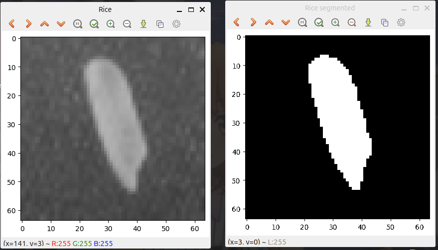
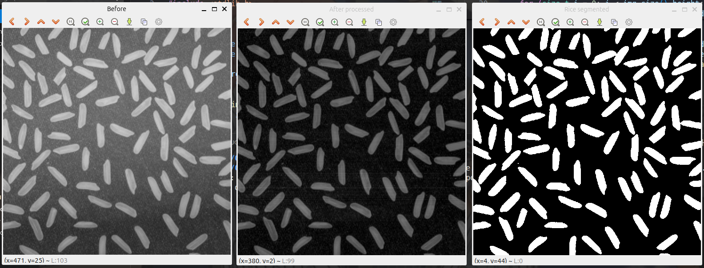

# Image Segmentation

Repository featuring image segmentation implementations in C++ using OpenCV, focused on rice grain detection via thresholding techniques.

## Results

### Rice Segmentation (Single grain)

### Rice Segmentation (Multi-grain)

